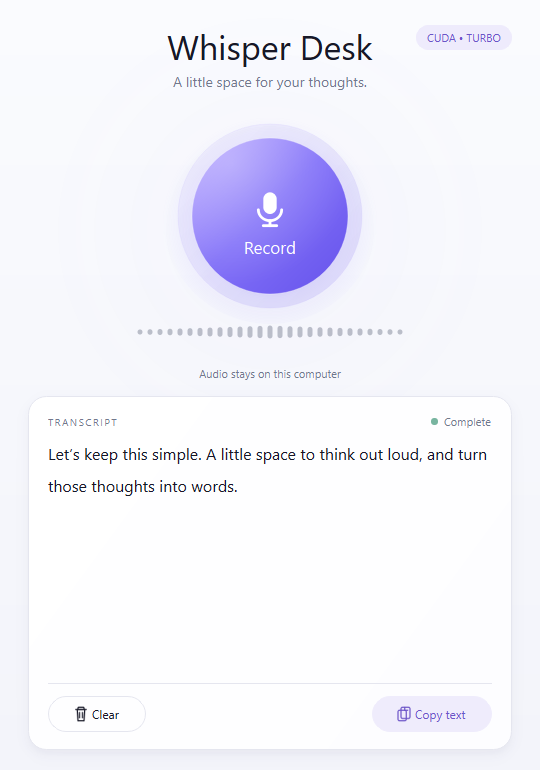
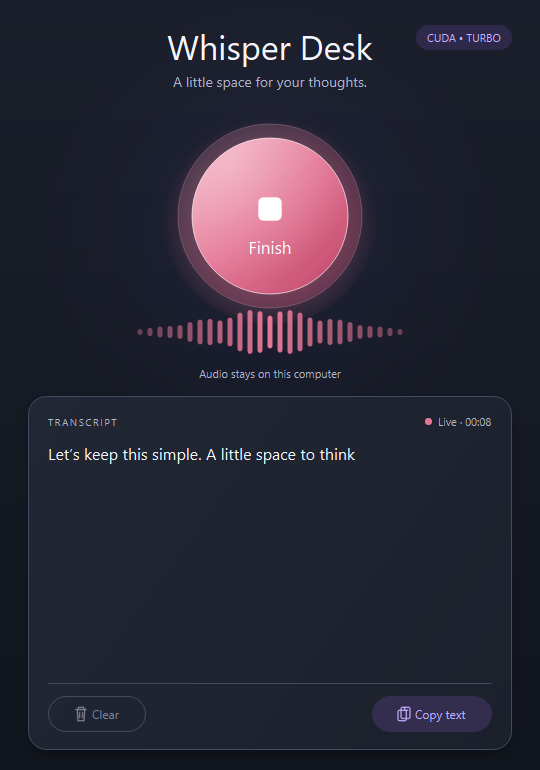

# WhisperDesk — Free, Private Offline Voice Transcription

[](https://github.com/Sam7/whisper-desk/releases/latest)

## Quick install preview

```powershell
choco install whisperdesk
```

The Chocolatey package is in moderation, so this command will work once it is approved. Until then, [download the Windows installer from GitHub Releases](https://github.com/Sam7/whisper-desk/releases/latest).

**Turn your voice into text on your own computer. No cloud subscription, no account, no per-minute fees.**

WhisperDesk is a free desktop speech-to-text app for **Windows 11**, powered by **OpenAI Whisper Turbo**. It delivers high-quality local audio transcription in a simple native interface: press Record, speak naturally, watch your words appear, and press Finish. Copy the text into your notes, emails, documents or favourite app.

Your audio stays on your computer. After the one-time setup downloads, transcription works **offline**, without sending recordings to a cloud transcription service or requiring an OpenAI API key.

## Light and dark mode

<table>
  <tr>
    <th>Light mode · completed transcription</th>
    <th>Dark mode · transcribing as you talk</th>
  </tr>
  <tr>
    <td></td>
    <td></td>
  </tr>
</table>

Actual application screenshots with demonstration text, captured at the default window size. Appearance follows your system's light or dark mode automatically on Windows.

## Why use Whisper Desk?

- **Private local transcription.** Microphone audio and speech recognition stay on your own machine. The normal app processes audio in memory rather than saving recordings.
- **Free speech-to-text.** No subscription, paid transcription API, account or usage quota imposed by the app.
- **OpenAI Whisper quality.** Uses the Whisper `turbo` model, an optimized version of `large-v3` designed for faster inference with minimal loss of accuracy. [About OpenAI Whisper](https://github.com/openai/whisper#available-models-and-languages).
- **Transcribes as you talk.** Incremental transcription starts during recording, so work is already underway when you press Finish. Live words may be revised as more context arrives.
- **Fast on compatible NVIDIA GPUs.** Local CUDA acceleration and a model that stays warm between recordings reduce waiting. CPU fallback is available.
- **A small native desktop utility.** One main button, clear audio feedback, readable text and easy copying. Built with Python and Qt; no browser or local web server.
- **Keep your thoughts together.** New recordings append beneath earlier text. Copy includes the accumulated transcript; Clear removes it.

Use it for desktop dictation, drafting emails, capturing ideas, writing notes and turning spoken thoughts into text without a cloud service.

## Record → speak → Finish → copy

1. Launch Whisper Desk and wait for **Ready for your voice**.
2. Press **Record** and start speaking. The waveform responds to your microphone, and live text begins to appear.
3. Press **Finish**. Whisper Desk reconciles the remaining audio into the final transcript.
4. Press **Copy text** and paste it wherever you need it.

Click the transcript to correct words, type, paste or delete text after Finish. Undo and redo work normally, and Copy includes your edits. Editing is temporarily locked during recording and finalization so live transcription cannot overwrite your corrections.

Record again to add another paragraph. Earlier text stays in the window until you press **Clear**. Transcripts are kept in memory for the current window; copy anything you want to keep before closing the app.

## Get started on Windows 11

The Windows installer handles Python, application dependencies, the Whisper Turbo model and NVIDIA GPU runtime libraries for you:

1. Download the versioned **WhisperDesk-<version>-Setup.exe** installer from [GitHub Releases](https://github.com/Sam7/whisper-desk/releases). Choose GPU acceleration if you have compatible NVIDIA hardware.
2. Allow setup to download and verify the transcription files. GPU setup downloads approximately **3.44 GB** in total; CPU setup downloads approximately **1.62 GB**. Installation also needs space for extraction and staging; setup checks this first.
3. Open **Whisper Desk** from the Start menu and speak. No separate Python, CUDA Toolkit or cuDNN installation is needed for the installed application.

A compatible **NVIDIA graphics driver** is still required for GPU mode. Setup checks actual inference, offers CPU mode and explains driver problems. Windows microphone access must be enabled for desktop apps. Completed downloads are retained for retries; an interrupted individual file starts again.

The release workflow builds and tests each versioned installer before publishing it. Chocolatey submissions and, after the one-time WinGet registration is accepted, WinGet update pull requests are handled by the tagged release workflow. See the [release guide](docs/releases.md) for package commands and release details.

The installer has been exercised through download, installation, upgrade, uninstall and reinstall, with offline CUDA transcription tested in both themes. Clean-machine release validation remains pending; see the [verification notes](docs/verification.md) for results and environment limits.

### Run from source

Install **64-bit Python 3.12**, download or clone this repository, then open PowerShell in its folder:

```powershell
python -m venv .venv
.\.venv\Scripts\python -m pip install --upgrade pip
.\.venv\Scripts\python -m pip install -e .
.\.venv\Scripts\python -m whisper_desk
```

Source launches can use **CUDA Toolkit 12** and **cuDNN 9 for CUDA 12**, with a compatible driver. See the [development CUDA setup guide](docs/setup-and-development.md#cuda-on-windows). The badge in the app shows **CUDA** or **CPU**.

The first launch downloads approximately **1.6 GB** of Whisper Turbo model weights. Once the download is complete and cached, you can transcribe without an internet connection. Allow microphone access for desktop apps in Windows privacy settings.

If you have a portable packaged build, launch `WhisperDesk.exe` from its complete folder. The [Windows installer](docs/windows-installer.md) is the recommended way to provision its GPU dependencies and model. A packaged app does not require Python to be installed.

## Does it work on Mac or Linux?

| Platform | Current application status | Acceleration |
| --- | --- | --- |
| **Windows 11, x64** | Verified with real microphone capture, live transcription and a packaged executable. | NVIDIA CUDA preferred; CPU fallback. |
| **macOS, Intel or Apple Silicon** | Not tested or packaged. A source port may be possible, but there is no verified Mac release. | The current engine uses CPU or CUDA; it has no Apple Metal/MPS inference path. |
| **Linux** | Not tested or packaged. Dependency support makes it a candidate for a source port, rather than a supported release today. | The underlying runtime supports CPU and NVIDIA CUDA on supported Linux systems. |

The [CTranslate2 runtime provides Windows, macOS and Linux Python wheels](https://opennmt.net/CTranslate2/installation.html), and the app skips Windows-only shell integrations on other systems. That does **not** establish full application compatibility: microphone behaviour, desktop integration and packaging still need platform testing. Linux may also need a system [PortAudio installation](https://python-sounddevice.readthedocs.io/en/latest/installation.html).

## Common questions

**Is it really offline?** Yes, after downloading the dependencies and model. Speech recognition runs locally; your recording is not uploaded for transcription.

**Do I need an OpenAI account or API key?** No. Whisper Desk runs the OpenAI Whisper model locally through [faster-whisper](https://github.com/SYSTRAN/faster-whisper), rather than calling the OpenAI API.

**Does it support other languages?** Whisper Turbo supports multilingual speech recognition. The app detects the spoken language automatically, or you can set a language code when launching, for example `--language en`. This utility transcribes speech; it does not offer a translation workflow.

**How fast is it?** On the development RTX 4060, live text appeared in roughly two seconds, and several recordings finalized in well under a second after Finish. These are measured examples, not a guarantee for every recording or computer. See the [verification notes](docs/verification.md).

## Setup, testing and development

See the [setup and development guide](docs/setup-and-development.md) for pinned dependencies, CUDA troubleshooting, streaming architecture, automated tests, visual checks and PyInstaller packaging. The [verification notes](docs/verification.md) distinguish actual hardware runs from mocked tests and remaining manual checks.

## Install with WinGet

After the initial manifest submission is accepted, install with WinGet:

```powershell
winget install DotSam.WhisperDesk
```

Both packages use the exact versioned GitHub Release installer and verify its SHA-256. Check the [WhisperDesk package page](https://community.chocolatey.org/packages/whisperdesk) on the [Chocolatey Community Repository](https://community.chocolatey.org/) for its listing and moderation status. A Chocolatey version in moderation is not available through normal package search or installation until it is approved. WinGet becomes available after Microsoft's initial manifest review and acceptance.

Whisper Desk is an independent application using [OpenAI Whisper](https://github.com/openai/whisper) model weights and the [faster-whisper](https://github.com/SYSTRAN/faster-whisper) inference implementation.

---

*Requires compatible hardware. Speed and transcription accuracy vary with your computer, microphone, language and audio quality; a compatible NVIDIA GPU is recommended for fast live transcription.*
